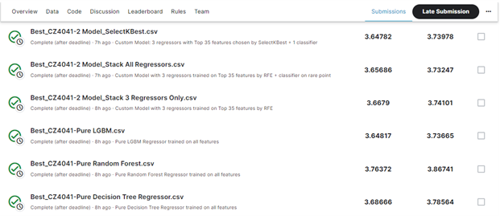
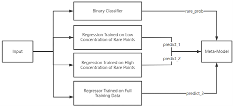

# CZ4041-Machine-Learning

This repository contains the code that generates the final prediction output to submit to [Kaggle Elo Merchant Recommendation competition](https://www.kaggle.com/competitions/elo-merchant-category-recommendation/) as the project for Nanyang Technological University's (NTU) Machine Learning (CZ4041) course. 5 members (GitHub repo collaborators) worked on this 14-week project in AY2022/23 Sem 2 (Jan-Apr 2023).

# Summary
Elo competition is a regression problem that aims to predict the loyalty score of a card based on the card's merchants and its purchase details, and evaluates on RMSE score. However, it has 4 significant challenges:
1. Feature are anonymised, making feature engineering difficult to be interpreted
2. Inconsistency due to stochasticity of splitting the dataset. Despite K-Fold Cross Validation method, the attainable RMSE score spans a wide range, so the best model on the validation set may perform worse in Kaggle Private Leaderboard
3. Overly imbalanced data: 1.1% train data have loyalty scores about -30, instead of the others that normally center at 0
4. Huge raw feature list, but the features require aggregation so that the prediction of the `test.csv` file has the same number of rows as the intended output format (i.e. loyalty scores of all the test `card_id`s are predicted). Some test rows also have null values.

To address these challenges, strategies adopted in the pre-machine learning phase are as follows:
- Preprocessing: imputation with mode, investigating data correlation
- Feature engineering: one-hot encoding, feature generation via aggregation by various dimensions (inspiration from some existing notebooks, such as [Raddar's](https://kaggle.com/code/raddar/target-true-meaning-revealed)), feature selection by PCA

In the machine learning phase, various models were used. The best of various models were used to predict `test.csv`, which are the following:
- Pure LGBM Regressor
- Pure Random Forest Regressor
- Pure Decision Tree Regressor
- An Ensemble with model architecture inspired by [Patekha](https://www.kaggle.com/c/elo-merchant-category-recommendation/discussion/82314)

The performance of the predictions is based on Public Leaderboard Score and Ranking. With this evaluation metric, Pure LGBM Regressor is the best among the pure models used, whereas the ensemble performs the best among all the models experimented, with a score of 3.73247 (at the time of project submission).

The model architecture of the ensemble is depicted in the figure below. The first-level models include a binary classifier that outputs the probability that a point is rare (i.e. target loyalty score < -30), and 3 regressors that train on somewhat different datasets: 
- entire train data
- train data concentrated with rare points: all rare points and non-rare points which constitute 20% the amount of rare points
- train data less concentrated with rare points: all non-rare points and 20% of the original amount of rare points

In layman-terms, the meta-model has opinions from 3 regressors, and can be informed by the probability from the binary classifier. This can mitigate the issue of predicting all points to have target scores around 0 instead of -30, thus lowering the RMSE.

# How to Read this Repo
There are 3 subfolders:
## `notebooks`
The notebooks in this GitHub are collated, cleaned and documented orderly after the project submission. This includes the seed setting of the entire notebook. Therefore, the best scores obtained as shown in the leaderboard score above may not be retrieved. The updated notebooks with seeds produce results that hit similar scores, although slightly less than the ones attained by the original notebooks during the project work.

Each notebook is denoted in the format "<notebook_order_number>_<description>[_part-i].ipynb", where `[]` means optional. Thus, the notebooks should be read as follows:
  
1. "1_preprocessed.ipynb"
2. "2a_model-pure_lgbm.ipynb"
3. "2b_model-ensemble_part-1.ipynb"
4. "2b_model-ensemble_part-2.ipynb"
  
Each notebook begins with a hyperlinked-outline, typically having Introduction, Reusable Utility Functions and Dataset imports. Additional explanations and experiments begin after the Dataset imports.

## `images`
Images are purely images for the readme file.

## `predictions`
These are predictions of the best models for each category. Note that the result csv's filename is different from the csv name produced by the notebooks (you can find the names at the last cell of the notebooks, where the prediction dataframes are stored to a csv file) as the uploaded csv files are the exact files that were submitted to Kaggle. It will also facilitate you in locating the exact file that generated the score in the leaderboard ranking screenshot in this readme file. Nevertheless, the csv filenames are sufficient to describe the model that created that file of predictions.
